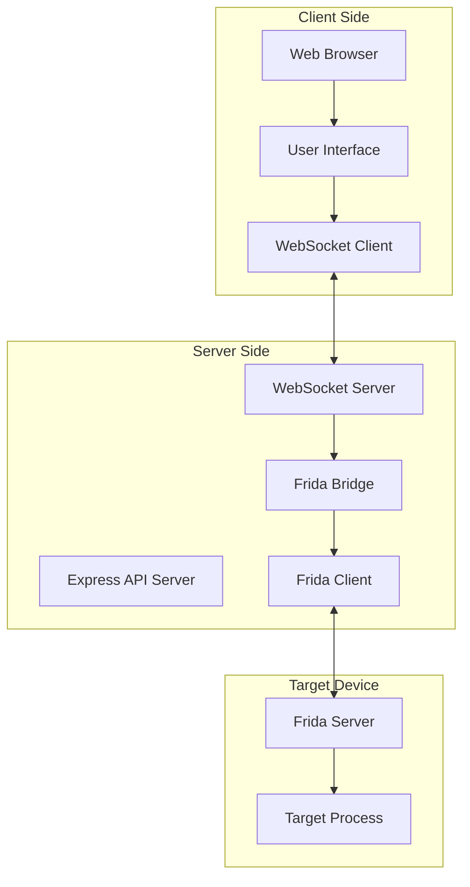

# Frida Bridge for Web

A bridge between Frida and web clients that allows you to use Frida's instrumentation capabilities directly from a web browser.

## Architecture



## Features

- Connect to Frida from a web browser
- List and select available devices
- List and select processes on the device
- Attach to processes
- Create, load, and run Frida scripts
- Receive and send messages between web client and Frida scripts
- Real-time communication using WebSockets

## Requirements

- Node.js (v14+)
- Frida server running on the target device
- Visual Studio with C++ development tools (for Windows)
- C/C++ build tools (for Linux/macOS)

## Installation

```bash
# Clone the repository
git clone https://github.com/yourusername/frida-bridge.git
cd frida-bridge

# Install dependencies
npm install
```

## Usage

### Start the server

```bash
# Development mode (with auto-reload)
npm run dev

# Production mode
npm start
```

The server will start on port 3000 by default. You can access the web client by opening http://localhost:3000 in your browser.

### Web Client Usage

1. Click "Connect to Frida" to establish a connection
2. Select a device from the dropdown menu
3. Click "Refresh Processes" to get a list of processes on the selected device
4. Select a process from the dropdown menu and click "Attach to Process"
5. Write your Frida script in the editor and click "Load Script"
6. Use the "Send Ping" button to test communication with the script
7. Check the console for script messages and responses

## API

### WebSocket Events

The Frida bridge server exposes the following Socket.IO events:

- `connect-frida`: Connect to Frida
- `disconnect-frida`: Disconnect from Frida
- `get-devices`: Get available devices
- `select-device`: Select a device
- `get-processes`: Get processes on the selected device
- `attach-process`: Attach to a process
- `create-script`: Create and load a script
- `post-message`: Send a message to the script
- `script-message`: Receive messages from the script

## Example Frida Script

```javascript
(function() {
  // Log when the script is loaded
  console.log("Frida script loaded!");
  
  // Send a message back to the Node.js side
  send({type: "message", text: "Hello from Frida!"});
  
  // Handle messages from Node.js
  recv("ping", function() {
    send({type: "pong", timestamp: new Date().toISOString()});
  });
  
  // Hook a function
  Interceptor.attach(Module.findExportByName(null, "open"), {
    onEnter: function(args) {
      var path = Memory.readUtf8String(args[0]);
      send({
        type: "function-called",
        function: "open",
        path: path
      });
    }
  });
})();
```

## License

ISC 